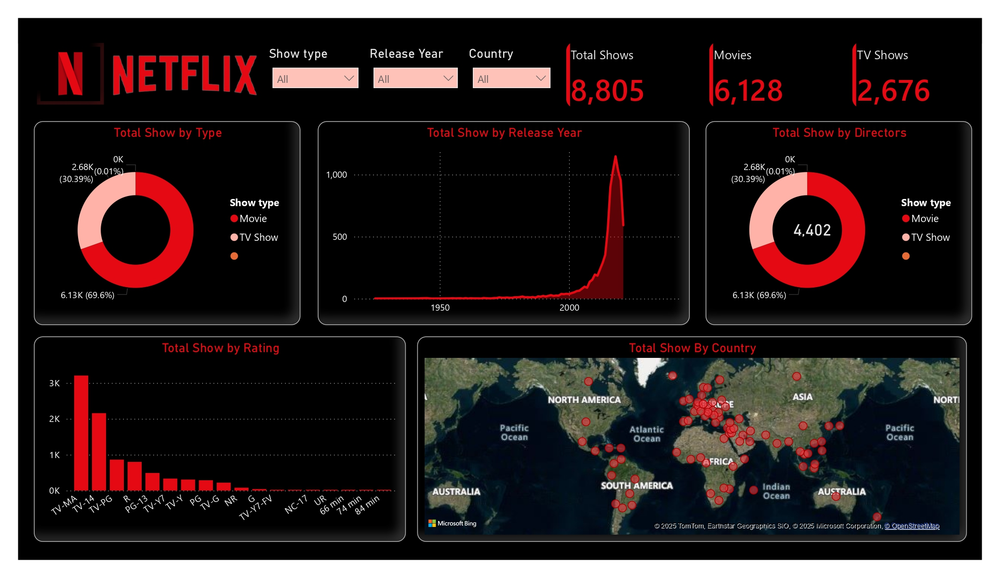

# Netflix-Dashboard-Using-Power-BI

## 📌 Overview  
This Power BI Dashboard provides an interactive visualization of the Netflix dataset, offering insights into the total number of shows, their distribution by type, release year, directors, ratings, and country of origin. The dashboard helps analyze Netflix content trends and provides data-driven insights for decision-making.  

## 🖼️ Dashboard Preview  
  

## 🔥 Features  
- **Total Shows**: Displays the total number of Netflix titles, including both Movies and TV Shows.  
- **Show Type Analysis**: Breakdown of content into Movies and TV Shows, with respective counts and percentages.  
- **Release Year Trend**: A visualization of how many shows were released each year.  
- **Director Contribution**: Insights into the number of shows directed by various filmmakers.  
- **Content Rating Distribution**: Shows the classification of content based on ratings like TV-MA, TV-14, R, PG-13, etc.  
- **Geographical Distribution**: A map representation of shows based on their country of origin.  

## 📊 Data Source  
The dataset used in this dashboard consists of Netflix titles, including metadata such as type, release year, director, rating, and country. The data has been processed and cleaned to ensure accuracy in visualization.  

## 🛠️ Tools & Technologies  
- **Power BI Desktop** - For data visualization and dashboard creation.  
- **DAX (Data Analysis Expressions)** - Used for calculations and data manipulation.  
- **SQL/Python (if applicable)** - Used for pre-processing and transforming the dataset before importing it into Power BI.  

## 🚀 Usage  
1. Clone this repository and open the Power BI dashboard file (`.pbix`) in **Power BI Desktop**.  
2. Interact with the filters to analyze data based on specific years, countries, or show types.  
3. Use the **visual insights** to understand content trends on Netflix.  

## 🔮 Future Enhancements  
- Adding **trend analysis** on Netflix content growth over the years.  
- Implementing **user engagement metrics** to analyze show popularity.  
- Enhancing the **geographical representation** with more interactive features.  

## 👤 Author  
**[Your Name]**  
📧 [Your Email]  
🔗 [LinkedIn Profile (if applicable)]  

---

⭐ If you found this project useful, please **star** this repository!  
